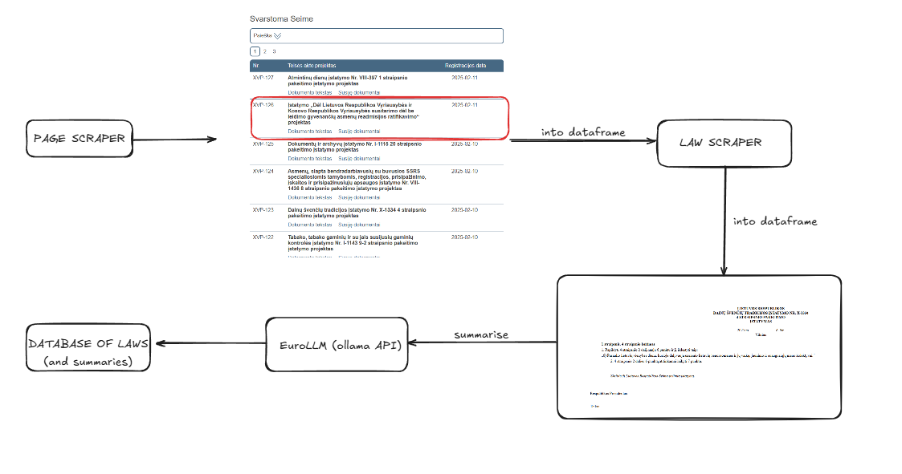

# Lithuanian Parliament law analyser
This app aims to be a way to increase transparency in the operations of parliament. It scrapes the laws being discussed from the website, and utilises [EuroLLM](https://arxiv.org/pdf/2409.16235v1).

The basic flowchart of the app can be found below:
.